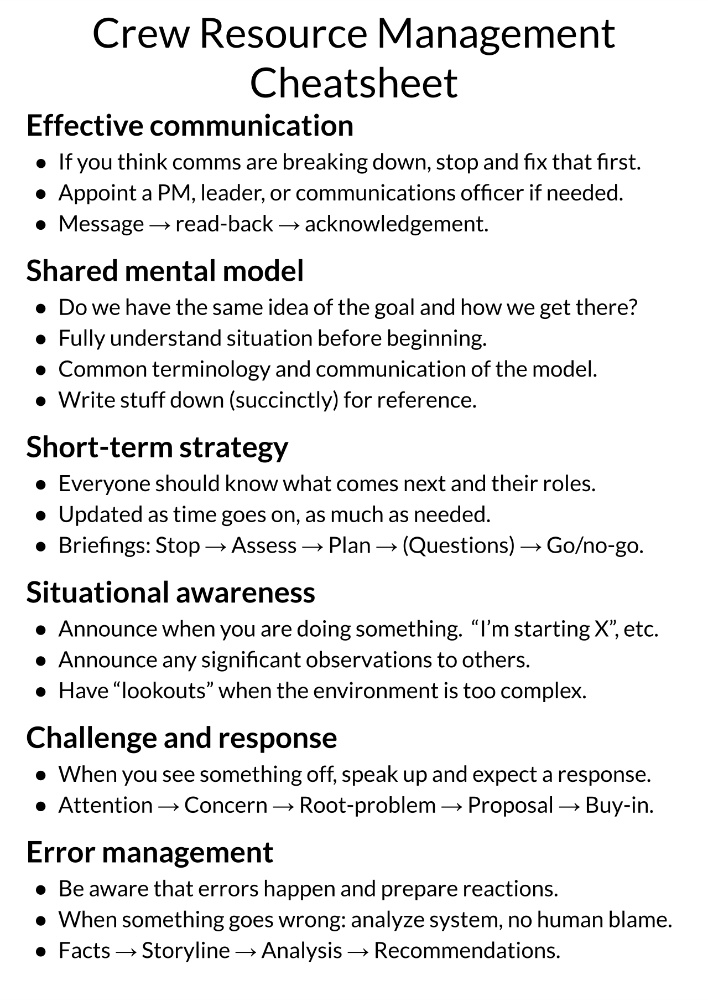

# Crew Resource Management training

rkdarst's own [crew resource
management](https://en.wikipedia.org/wiki/Crew_resource_management)
training designed for office workers (the pilot users are university
technical services).  The training is delivered as a cooperative game,
interspersed with lessons and reflection.

Professional teams have dedicated teamwork training known as "Crew
resource management".  While we (university technical services and
similar) are not comparable to pilots, rescue services, etc., there
are some things we can learn from them to make our own work more
better - by making sure we can use all human resources to their best.

## How it works

In my training, you play as a crew working to operate a spaceship
(think the bridge team in Star Trek), interspersed with my lessons.

* We play the cooperative game [Empty
  Epsilon](https://daid.github.io/EmptyEpsilon/), which allows six
  players to command a simulated spaceship - each player with one
  role.
* rkdarst gives four modules of lessons, each with an introduction,
  playing, then reflection on how it connects to us office workers.
* At the end, the players will think more about how they work together
  and hopefully make better use of their whole team.
* There can be multiple ships networked together and playing together.
* Minimum reasonable number of players is four, maximum I am prepared
  for (so far) is around 18.

## Prerequisites

* The best time period is one day (morning session, lunch, afternoon
  session) but shorter can possibly work.
* One area (one or multiple tables) per team of six players (ideally
  in its own room or space).
* One player per ship gets advance prep to help guide the other
  players.
* Players should watch two 5-minute videos in advance (assigned
  per-person to get a good distribution of skills).
* A desire to work together and think about how you work together.

Many of these can be adjusted as needed.

## Material

* [CRM cheatsheet](static/CRM-cheatsheet.pdf)
* [CRM cheatsheet (8up)](static/CRM-cheatsheet-8up.pdf), print "duplex
  short edge"
* [CRM training worksheet](static/CRM-training-worksheet.pdf)

## Gallery

